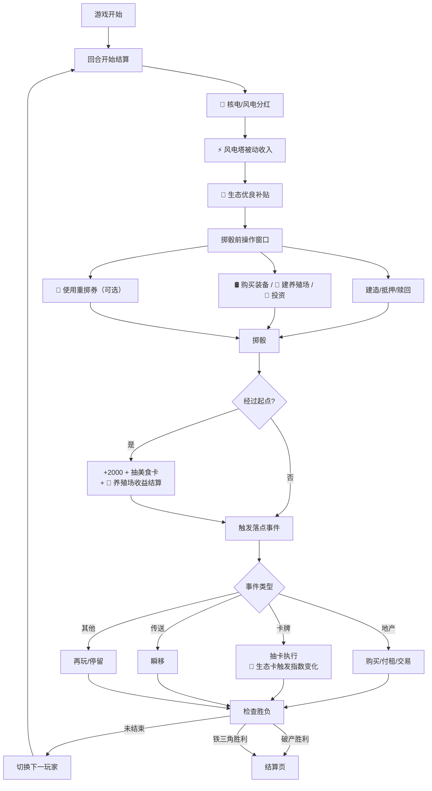
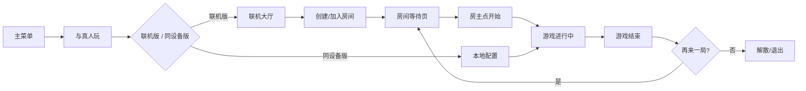

# 《仙境海岸·大富翁》产品需求文档（PRD V3.7）

> **文档版本**：V3.7
> **生成日期**：2026-07-14
> **适用范围**：三条件独立胜负 + AI 三档优化 + 四大海洋板块 + 联机回合隔离
> **前序文档**：V3.0 / V3.4（已归档）

---

## 目录

- [1. 产品概述](#1-产品概述)
- [2. 用户与场景](#2-用户与场景)
- [3. 功能清单](#3-功能清单)
- [4. 四大海洋板块（V3 核心）](#4-四大海洋板块v3-核心)
- [5. 核心流程](#5-核心流程)
- [6. 界面设计](#6-界面设计)
- [7. 核心规则](#7-核心规则)
- [8. 胜利条件](#8-胜利条件)
- [9. 非功能性需求](#9-非功能性需求)
- [10. 版本演进与未来规划](#10-版本演进与未来规划)

---

## 1. 产品概述

### 1.1 产品定位

《仙境海岸·大富翁》是一款以山东烟台文旅为主题的网页版大富翁游戏。V3 在原 Demo 基础上新增**四大海洋板块**（海工装备 / 海产养殖 / 核电投资 / 海洋生态），并支持**跨设备联机对战**，同时保持原有玩法逻辑完全不变。

### 1.2 核心价值

| 维度 | 说明 |
|---|---|
| **文旅推广** | 烟台 21 处真实地标 + 海洋经济主题，寓教于乐 |
| **玩法深度** | 四大板块增加装备/养殖/投资/生态博弈维度，决策点丰富 |
| **社交联机** | 跨设备 WebSocket 联机，异地亲友可同房对战 |
| **轻量即玩** | 单文件 HTML，浏览器打开即玩，无需安装 |

### 1.3 版本演进

| 版本 | 核心特性 | 状态 |
|---|---|---|
| V1.0 | 单机 Demo（掷骰/地产/卡牌/铁三角胜利） | ✅ 已上线 |
| V2.0 | 联机版（WebSocket 房间/跨设备对战） | ✅ 已上线 |
| **V3.0** | **四大海洋板块 + UI 优化 + 规则完善** | **✅ 本次交付** |

---

## 2. 用户与场景

### 2.1 用户角色

| 角色 | 说明 |
|---|---|
| 单机玩家 | 1 人本地游玩，可加 AI 对手 |
| 同设备多人 | 2-4 人面对面轮流操作（hot-seat） |
| 联机玩家 | 2-4 人跨设备通过房间 Key 加入，异地对战 |
| 房主 | 联机模式下创建房间的玩家，负责开始/解散 |

### 2.2 典型使用场景

1. **课堂/社团展示**：单机模式 + AI，15-30 分钟一局，展示烟台文旅
2. **朋友聚会**：同设备多人模式，4 人轮流，社交互动
3. **远程联机**：异地亲友通过房间 Key 联机，共享一局游戏
4. **文旅推广活动**：现场大屏 + 观众手机扫码加入房间

---

## 3. 功能清单

### 3.1 功能全景

```
仙境海岸·大富翁
├── 对战模式
│   ├── 单机 AI（1-2 真人 + 1-3 AI）
│   ├── 同设备多人（2-4 真人轮流）
│   └── 联机对战（2-4 人跨设备）              [V2]
├── 核心玩法（原 Demo）
│   ├── 36 格棋盘 + 21 处地产 + 4 色块
│   ├── 掷骰/移动/购买/建造/过路费/抵押
│   ├── 机会卡/命运卡/美食卡
│   ├── 传送/再玩/停留特殊格
│   └── 破产/铁三角双胜利
├── 四大海洋板块                               [V3 新增]
│   ├── 🛢️ 海工装备系统
│   ├── 🐚 海产养殖系统
│   ├── 💼 核电投资系统
│   ├── 🌿 海洋生态系统
│   └── 🎫 重掷券决策点
├── UI 与交互                                  [V3 优化]
│   ├── 棋子悬浮外置（TokenLayer）
│   ├── 6 种棋子
│   ├── 生态徽章
│   ├── 投资入口
│   └── 日志增强（图标+导出）
└── 房间系统                                   [V2]
    ├── 创建/加入房间
    ├── 等待页/开始/解散
    └── 断线重连
```

### 3.2 功能模块详情

#### 3.2.1 主菜单页

| 模块 | 功能 | V3 变更 |
|---|---|---|
| 模式选择 | 与真人玩（→联机/同设备）/ 与 AI 玩 | — |
| 玩家配置 | 昵称输入、棋子选择 | ✅ 棋子从 4 种扩展到 6 种 |
| 规则速览 | 折叠面板 | — |

#### 3.2.2 联机大厅（V2）

| 模块 | 功能 |
|---|---|
| 昵称输入 | 1-8 字符，localStorage 记忆 |
| 创建房间 | 自定义房间 Key（4-10 位字母数字） |
| 加入房间 | 输入已有 Key 加入 |

#### 3.2.2a 联机回合隔离与房间生命周期（V3.5/V3.6）

| 规则 | 说明 |
|---|---|
| 回合隔离 | 房主首先掷骰，按玩家阵营顺序轮流。**只有当前回合玩家能操作**（掷骰/购买/租房/传送），其他玩家看到观战提示"⏳ 等待 XXX 操作..."，交互弹窗和按钮全部禁用 |
| 四道防线 | ①前端 canRollDice 检查 isMyTurn ②按钮 :disabled ③interactivePendingModal 仅自己事件显示 ④服务端 rollDice 校验 currentPlayerIndex |
| 统一退出 | waiting/playing/ended 三阶段同一套 handlePlayerExit 逻辑：房主退出=解散房间；玩家退出=引擎移除（地产归银行+补位）；退到只剩房主回等待界面 |
| 座位对齐 | myPlayerId 存引擎数组下标（playerSeats.findIndex），确保与 currentPlayerIndex 对齐 |

#### 3.2.3 游戏主界面

| 模块 | 功能 | V3 变更 |
|---|---|---|
| 棋盘区 | 36 格环形布局 | ✅ 棋子悬浮到格子外侧（TokenLayer） |
| 顶部状态栏 | 回合数/当前玩家/退出 | ✅ 新增生态徽章 |
| 玩家面板 | 资金/地产/美食/状态 | — |
| 骰子组件 | 两骰动画 | — |
| 操作按钮 | 掷骰/资产/美食/放弃 | ✅ 新增重掷按钮 |
| 事件弹窗 | 购买/卡牌/传送等 | — |
| 游戏日志 | 事件记录 | ✅ 四板块专属图标 + 导出 |
| 投资入口 | — | ✅ 左下方固定「投资核电」按钮 |

#### 3.2.4 结算页

| 模块 | 功能 | V3 变更 |
|---|---|---|
| 胜者展示 | 头像/名称/获胜方式 | — |
| 资产排名 | 总资产排序 | ✅ 总资产含四板块估值 |
| 再来一局 | 返回主菜单 | — |

---

## 4. 四大海洋板块（V3 核心）

### 4.1 设计铁律

> **四大板块的增添不允许打乱原有玩法逻辑**，所有新增模块以"扩展"而非"替换"方式接入。**36 格棋盘结构不可变**。

| 原玩法 | 兼容方式 |
|---|---|
| 36 格棋盘 | 不变，四板块均不新增格子 |
| 21 处地产 | 不变，养殖场是 4 处地产的可选升级路径 |
| 色块加成 | 不变，养殖地产仍参与色块加成 |
| 过路费公式 | 末尾乘装备系数，原公式零改动 |
| 胜利条件 | 不变（破产 + 铁三角） |

### 4.2 🛢️ 海工装备系统

**玩法**：玩家拥有 4 处装备供应点地标后，可在资产面板购买对应装备，装配到地产获得持续增益。

| 装备 | 供应点地标 | 售价 | 效果 |
|---|---|---|---|
| 🛢️ 海洋钻井平台 | 芝罘湾广场（格1） | 2000 | 装配海岸线地产，过路费 +30% |
| 🤖 深海机器人 | 渔人码头（格12） | 2000 | 装配仙山地产，过路费 +30% |
| 🛳️ 海洋监测船 | 天马栈桥（格33） | 2000 | 免疫台风/赤潮命运卡 |
| ⚡ 海上风电塔 | 机场（格35） | 2000 | 每回合 +300 电力分红 |

**过路费公式**：`基础过路费 × 色块加成 × 建筑系数 × 装备系数(1.3 或 1.0)`

### 4.3 🐚 海产养殖系统

**玩法**：4 处海岸渔业地产可选建造养殖场（与房屋互斥），提供 3 级被动收入，每经过起点结算。

| 养殖地产 | 特产 | L1 育苗场 | L2 养殖场 | L3 深海牧场 |
|---|---|---|---|---|
| 长岛 | 海参 | 成本1500/收益500 | 成本1500/收益1200 | 成本2000/收益2500 |
| 养马岛 | 扇贝 | 同上 | 同上 | 同上 |
| 万鸟岛 | 海带 | 同上 | 同上 | 同上 |
| 月亮湾 | 鲍鱼 | 同上 | 同上 | 同上 |

**关键规则**：
- 养殖场与房屋**互斥**（同块地产二选一）
- 过路费恒为「空地基础 × 色块加成」，**不随养殖等级提升**
- 收益受生态减益影响（预警 -30%，危机 -60%）

### 4.4 💼 核电投资系统

**玩法**：独立投资项目（不占棋盘格），左下方固定按钮入口，每回合开始分红。

| 项目 | 投入 | 每回合分红 | 限购 | 风险 |
|---|---|---|---|---|
| 🔬 海阳核电1号 | 5000 | +800 | 全局1份 | 核事故卡→付3000+3回合无分红 |
| 🔬 海阳核电2号 | 5000 | +800 | 全局1份 | 1号事故连锁停发 |
| 🌀 海上风电场 | 3000 | +400 | 全局2份 | 无风险 |

### 4.5 🌿 海洋生态系统

**玩法**：全局生态指数（0-100，初始50），生态卡影响指数，指数档位影响全局经济。

| 指数 | 状态 | 全局效果 |
|---|---|---|
| 80-100 | 🟢 优良 | 每回合 +200 环保补贴 |
| 50-79 | 🟡 正常 | 无加成无减益 |
| 20-49 | 🟠 预警 | 养殖场收益 -30% |
| 0-19 | 🔴 危机 | 养殖 -60%，核电分红 -50% |

**新增卡牌**：6 张生态机会卡（C_E1~C_E6，正面）+ 6 张生态命运卡（D_E1~D_E6，含核事故/赤潮/台风）。

### 4.6 🎫 重掷券（决策点增强）

**玩法**：集齐任一色块奖励 1 张重掷券（最多 3 张），自己回合可使用获得额外掷骰机会。

> 不破坏对子连掷三连入桥的原规则。

---

## 5. 核心流程

### 5.1 单局主流程（含四板块）



### 5.2 联机房间流程（V2）



---

## 6. 界面设计

### 6.1 设计风格

- **主题**：仙境海岸·烟台文旅，海蓝色调主导 + 沙金/砖红点缀
- **主色板**：海蓝 `#1E88E5`、沙金 `#FBC02D`、砖红 `#E53935`、松绿 `#43A047`
- **色块色值**：历史街区红 `#E74C3C`、海岸线蓝 `#3498DB`、仙山绿 `#27AE60`、温泉橙 `#F39C12`
- **生态色值**：优良 `#43A047`、正常 `#FBC02D`、预警 `#FB8C00`、危机 `#E53935`

### 6.2 V3 UI 新增

#### 棋子悬浮外置

```
改造前：棋子在格内底部，被 overflow:hidden 裁剪
改造后：棋子悬浮到格子边缘外侧（TokenLayer 独立图层）

     ┌────┐         ┌────┐
     │地标│  🐳 ←  │地标│
     └────┘         └────┘
  （左侧外移）    （右侧外移）

  顶行：棋子在格子上方
  底行：棋子在格子下方
  四角：棋子在对角外侧
```

- 同格多棋子按象限错位避让（最多 4 人）
- 当前回合棋子带玩家色边框 + 轻微弹跳动画

#### 新增 UI 元素

| 元素 | 位置 | 功能 |
|---|---|---|
| 🌿 生态徽章 | 顶部状态栏 | 实时显示生态指数，点击查看详情 |
| 💼 投资核电按钮 | 左下方固定 | 打开投资面板 |
| 🎫 重掷按钮 | 底部操作区 | 使用重掷券（有券时显示） |
| 🛢️ 买装备按钮 | 资产面板地产条目 | 打开装备购买弹窗 |
| 🐚 建养殖场按钮 | 资产面板养殖地产条目 | 打开养殖管理弹窗 |
| 📜 日志导出按钮 | 日志面板顶部 | 导出 .txt |

### 6.3 响应式断点

| 断点 | 视口 | 布局 |
|---|---|---|
| xl | ≥1440px | 三栏 + 居中留白 |
| lg | 1024-1439px | 桌面三栏 |
| md | 768-1023px | 棋盘 + 侧栏抽屉 |
| sm | 480-767px | 纵向，面板折叠为抽屉 |
| xs | <480px | 紧凑纵向，棋子缩小 |

---

## 7. 核心规则

### 7.1 棋盘与格子

- 36 格环形棋盘，7 种格子类型：起点、地产、机会、命运、传送、移动、停留
- **21 处地产**分属 4 色块（历史街区红 4 块 / 海岸线蓝 8 块 / 仙山绿 5 块 / 温泉橙 4 块）
- 特殊格：格5 烟台山灯塔→蓬莱阁；格13 鲸鲨馆再玩；格18 跨海大桥停留；格25 八仙渡海口→任意空地；格35 机场→任意格

### 7.2 经济规则

| 项 | 规则 |
|---|---|
| 初始资金 | 15000 元 |
| 经过起点 | +2000 元 + 抽美食卡 |
| 建造费用 | 地价 × 0.4 |
| 过路费 | 基础 × 色块加成 × 建筑系数 × 装备系数 × **惩罚倍数(2.0)** |
| 抵押 | 得地价 × 0.5；赎回 × 1.1 |
| 色块加成 | 历史街区全齐×2 / 海岸线任意4块×1.5 / 仙山全齐×2 / 温泉全齐×2 |
| **扣款加倍** | 租金、卡牌罚款、核事故救援费统一 ×2.0（盈利项不受影响），保证游戏可终结 |

### 7.3 卡牌系统

| 类型 | 数量 | 说明 |
|---|---|---|
| 机会卡 | 16+6=22 张 | 正面收益，V3 追加 6 张生态机会卡 |
| 命运卡 | 16+6=22 张 | 风险机遇，V3 追加 6 张生态命运卡（含核事故） |
| 美食卡 | 4种×4=16 张 | 集齐 4 种兑换 2000 元或免租券 |

### 7.4 四大板块规则

详见 [game-design-v3.md](./game-design-v3.md) 第二章。

---

## 8. 胜利条件

### 8.1 三条独立胜利条件（V3.4，任意达成即胜）

胜利检查遍历所有存活玩家，以下任意一条成立立即结束游戏：

| 胜利方式 | 触发条件 | 优先级 |
|---|---|---|
| **破产胜利** | 仅剩 1 名玩家未破产 | 高 |
| **仙境铁三角胜利** | 同时持有烟台山 + 蓬莱阁 + 养马岛，**且每处地标建筑等级 ≥ 3（即各建 3 座房屋，共 9 座）** | 中 |
| **资产胜利** | 任一玩家**总资产 > 30000 元**（独立条件，无需集齐铁三角） | 低 |

> 同一次判定中若多条同时满足，按 优先级 取胜者。

### 8.2 关键判定

- **三条条件互相独立**：资产胜利不要求集齐铁三角，任何玩家资产达标即胜
- **铁三角抵押不影响所有权判定**：只要所有权属于该玩家即算集齐
- **实时检测**：在所有资产/所有权变化后立即判定（购买、建房、过起点、分红、收租、卡牌、美食兑换）
- **遍历所有玩家**：不仅检查当前操作玩家，而是遍历所有存活玩家（资产胜利可能由非操作玩家满足）

### 8.3 破产清算顺序

```
卖建筑（半价）→ 卖装备（50%）→ 抵押地产（50%）→ 破产
破产后：装备/投资/养殖场/重掷券全部清零
```

### 8.4 结算总资产（前后端统一口径）

```
总资产 = 现金
       + 地产估值（未抵押按原价，已抵押按 price × 0.5）
       + 建筑估值（buildCost × 等级，全额）
       + 养殖场估值（累计投入 × 0.5）
       + 装备估值（price × 0.5）
       + 投资估值（cost × 0.5）
```
折价反映"变卖时无法全额回收"的实际价值。代码见 `Game.estimatePlayerAssets` / `server.engine.estimatePlayerAssets`。

### 8.5 AI 三档难度策略（V3.4）

| 难度 | 定位 | 策略要点 |
|---|---|---|
| **简单（新手导游）** | 不多想、随机为主 | 购买门槛高(×2.5)+40%随机放弃；50%概率不建房；落对手地产90%只租房；不投核电；抵押随机 |
| **普通（本地商人）** | 中等性价比 | 按色组集齐比例+建筑等级决策；落对手地产70%租房/20%买地皮 |
| **困难（仙境霸主）** | 深度思考、追求胜利 | 铁三角地标必买必升3级；色块集齐优先；买地皮前评估ROI；积极投资冲刺资产胜利；智能抵押保留高价值地产 |

---

## 9. 非功能性需求

### 9.1 性能

| 指标 | 目标 |
|---|---|
| 单局时长 | 15-30 分钟 |
| 首屏加载 | < 2 秒（单文件 HTML，330KB，gzip 98KB） |
| 棋子移动动画 | 300ms/格（桌面）/ 200ms/格（移动） |
| WebSocket 延迟 | < 200ms（同区域） |

### 9.2 兼容性

- 浏览器：Chrome / Edge / Safari / Firefox 最近两个大版本
- 设备：桌面 / 平板 / 手机竖屏横屏
- 操作系统：Windows / macOS / Linux / iOS / Android

### 9.3 可访问性

- 所有按钮带 `aria-label`
- 动画遵守 `prefers-reduced-motion`
- 色块加文字标签（非仅靠颜色区分）

---

## 10. 版本演进与未来规划

### 10.1 已完成版本

| 版本 | 功能 | 状态 |
|---|---|---|
| V1.0 | 单机 Demo | ✅ |
| V2.0 | 联机版 | ✅ |
| V3.0 | 四大海洋板块 + UI 优化 | ✅ |

### 10.2 已知待办（V4 候选）

| 待办 | 优先级 | 说明 |
|---|---|---|
| 服务端四板块同步 | 高 | `server/engine.js` 接入四板块，联机模式同步 |
| 服务端/前端引擎统一 | 中 | 统一 propertyRef 命名，消除数据分叉 |
| 拍卖流程 | 中 | 原 Demo 未实现，V4 补全 |
| 卡牌非现金效果 | 中 | move/teleport/jail 效果 |
| 音效与背景音乐 | 低 | 增强氛围 |
| 成就系统 | 低 | 单局结算展示 |

### 10.3 远期愿景

- **地图扩展包**：长岛离岛支线（可选支路开关，不破坏默认 36 格）
- **季节系统**：夏季过路费 ×1.2、冬季 ×0.9
- **多语言**：英文/日文国际化
- **数据持久化**：房间状态存数据库，支持断线重连恢复

---

> **文档结束** | V3.7 PRD | 2026-07-14 | 配套文档：[技术架构 TD V3.7](./TechnicalArchitecture-v3.7.md)、[游戏设计 V3.7](./game-design-v3.7.md)、[部署指南](./deployment-guide.md)
