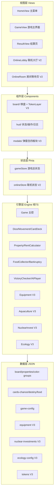

# 《仙境海岸·大富翁》技术架构文档（TD V3.5）

> **文档版本**：V3.5
> **生成日期**：2026-07-14
> **技术栈**：Vue 3 + Vite + TypeScript + Pinia（前端）| Node.js + ws（服务端）
> **前序文档**：V3.0 / V3.4（已归档）

---

## 目录

- [1. 架构总览](#1-架构总览)
- [2. 前端引擎层（纯 TypeScript）](#2-前端引擎层纯-typescript)
- [3. 四大海洋板块引擎设计](#3-四大海洋板块引擎设计)
- [4. 数据层设计](#4-数据层设计)
- [5. 状态管理](#5-状态管理)
- [6. 服务端架构](#6-服务端架构)
- [7. 关键算法与公式](#7-关键算法与公式)
- [8. 部署架构](#8-部署架构)
- [9. 已知技术债务](#9-已知技术债务)

---

## 1. 架构总览

### 1.1 系统全景

```
┌─────────────────────────────────────────────────────────┐
│                    云端服务器（VPS）                       │
│  ┌───────────────────────────────────────────────────┐  │
│  │  Node.js 进程（PM2 守护）                           │  │
│  │  ├─ HTTP 静态服务（server/public/index.html）       │  │
│  │  └─ WebSocket Server（ws 库，端口 3000 或 Nginx 80）│  │
│  │     ├─ rooms: Map<roomKey, Room>                   │  │
│  │     └─ clients: Map<ws, Player>                    │  │
│  └───────────────────────────────────────────────────┘  │
└──────────────┬──────────────────────────────────────────┘
               │ WebSocket（wss://）
       ┌───────┼───────┬───────┐
       ▼       ▼       ▼       ▼
    设备 A   设备 B   设备 C   设备 D
    (房主)  (玩家2)  (玩家3)  (玩家4)
    ─────────────────────────────────
         浏览器（Vue 3 单文件应用）
```

### 1.2 前端分层架构（V3）



### 1.3 核心设计原则

| 原则 | 说明 |
|---|---|
| **引擎与 UI 解耦** | `engine/` 为纯 TypeScript，不依赖 Vue，可在 Node 独立测试 |
| **数据与逻辑分离** | 所有可调参数进 JSON，引擎只读不算 |
| **单向数据流** | 用户操作 → store → engine → syncState → 组件重渲染 |
| **组件只读 store** | 不直接调用 engine，避免状态不同步 |
| **四板块以扩展接入** | 不修改原引擎逻辑，以乘法/叠加方式扩展（铁律） |

---

## 2. 前端引擎层（纯 TypeScript）

### 2.1 引擎模块全景（V3）

| 模块 | 职责 | V3 变更 |
|---|---|---|
| `Game.ts` | 主控类，整合所有子系统、回合流程 | ✅ 接入四板块 |
| `Dice.ts` | 骰子 + 对子连击判定 | 未改 |
| `Movement.ts` | 36 格环形移动 + 越界回绕 | 未改 |
| `CardDeck.ts` | 卡牌堆（抽/洗） | 未改 |
| `Property.ts` | 地产买卖/建房/旅馆/抵押/赎回 | 未改 |
| `RentCalculator.ts` | 过路费计算 | ✅ 末尾乘装备系数 |
| `FoodCollector.ts` | 美食卡收集/兑换 | 未改 |
| `Bankruptcy.ts` | 破产清算 | ✅ 清空四板块状态 |
| `VictoryChecker.ts` | 胜负判定 | **未改**（铁律） |
| `AIPlayer.ts` | AI 决策 | ✅ 新增四板块决策 |
| `types.ts` | 类型定义 | ✅ 新增四板块类型 |
| `Equipment.ts` | 🆕 海工装备管理 | 新建 |
| `Aquaculture.ts` | 🆕 海产养殖管理 | 新建 |
| `NuclearInvest.ts` | 🆕 核电投资管理 | 新建 |
| `Ecology.ts` | 🆕 海洋生态管理 | 新建 |

### 2.2 Game 主控类设计

```typescript
class Game {
  // 静态数据
  private config: GameConfig
  private board: BoardCell[]
  private properties: Property[]
  private colorGroups: ColorGroup[]

  // 原子系统
  private dice, movement, chanceDeck, destinyDeck
  private propertyManager, rentCalculator, foodCollector
  private bankruptcyHandler, victoryChecker, aiPlayer

  // 四大海洋板块子系统（V3）
  private equipmentManager: EquipmentManager
  private aquacultureManager: AquacultureManager
  private nuclearInvestManager: NuclearInvestManager
  private ecologyManager: EcologyManager

  // 游戏状态
  private state: GameState  // 含 ecology/soldEquipmentIds/soldInvestmentCopies
  private extraTurnPending: boolean

  // 核心方法
  init(mode, playerConfigs)        // 初始化（含四板块状态）
  rollDice()                       // 掷骰（前置 settleTurnStart）
  handleCellEvent()                // 落格事件
  settleTurnStart()                // 🆕 回合开始结算（分红/补贴/维护）
  buyEquipment/investNuclear/...   // 🆕 四板块操作
  checkVictory()                   // 胜负判定（未改）
}
```

### 2.3 回合状态机

```
idle → rolling → moving → event → resolving → ended
 ↑                                          ↓
 └──────────── extraTurnPending ←──────────┘
（对子连掷 / reroll 格 / 🎫重掷券）
```

---

## 3. 四大海洋板块引擎设计

### 3.1 EquipmentManager（海工装备）

```typescript
class EquipmentManager {
  buy(equipId, player, soldAtPropertyId, boundPropertyId): BuyResult
  unequip(equipId, player): boolean
  getRentBoostMultiplier(propertyId, owner): number  // 取最高，不累乘
  hasMonitorShip(player): boolean                     // 免疫台风赤潮
  getPassiveIncome(player): number                    // 风电塔每回合+300
  liquidateAll(player): number                        // 破产清算
}
```

**关键设计**：
- 每装备每局限购 1 件（`soldEquipmentIds` 全局集合）
- rentBoost 类必须装配到玩家拥有的同色块地产
- 同一地产多件装备取最高倍率（不累乘，避免膨胀）
- 装备效果通过 `RentCalculator.setEquipmentManager()` 注入，末尾乘系数

### 3.2 AquacultureManager（海产养殖）

```typescript
class AquacultureManager {
  buildOrUpgrade(propertyId, player): AquaResult  // 建造/升级
  demolish(propertyId, player): AquaResult        // 拆除（回收50%）
  settleIncome(player, ecologyPenalty): {total, details}  // 过起点结算
  applyRedTideDebuff(player): string[]            // 赤潮减益
  applyTyphoonDowngrade(player): string | null    // 台风降级
  tickDebuffs(player): void                       // 每回合维护
  estimateValue(player): number                   // 估值（结算用）
}
```

**关键设计**：
- 养殖场与房屋**互斥**（`player.buildings[propertyId] === 0` 校验）
- 过路费恒为「空地基础 × 色块加成」，不随养殖等级提升
- 收益结算在 `Game.handlePassStart()` 中调用，受生态减益影响
- 赤潮/台风由生态命运卡触发（D_E1/D_E3），海洋监测船可免疫

### 3.3 NuclearInvestManager（核电投资）

```typescript
class NuclearInvestManager {
  invest(projectId, player): InvestResult
  settleDividend(player, nuclearDividendPenalty): {total, details}  // 回合分红
  triggerAccident(players, triggeredProjectId): AccidentResult[]    // 核事故
  tickStopTurns(player): void                                       // 维护停发回合
  estimateValue(player): number
}
```

**关键设计**：
- 限购份数（`soldInvestmentCopies` 全局计数）：核电各 1 份，风电 2 份
- 分红结算在 `Game.settleTurnStart()` 中调用（回合开始时）
- 核事故连锁：1号事故时，`chainEffect` 中的 2号也停发（不另收费）
- 生态危机时分红 ×0.5（`nuclearDividendPenalty`）

### 3.4 EcologyManager（海洋生态）

```typescript
class EcologyManager {
  applyCardDelta(delta): {actualDelta, newIndex, tier}  // 生态卡影响
  tickNaturalRecovery(): {recovered, newIndex}          // 自然恢复
  getTier(): EcologyTier                                // 当前档位
  reset(): void                                         // 重置为初始值
}
```

**关键设计**：
- 4 档阈值硬编码（优良/正常/预警/危机），每档定义补贴/减益系数
- 生态卡（`category === 'ecology'`）在 `Game.applyCardEffect()` 中触发
- 抽到生态卡重置自然恢复计数；5 回合未抽到则 +2

### 3.5 四板块接入点（最小侵入）

| 原引擎方法 | 接入点 | 说明 |
|---|---|---|
| `Game.init()` | 初始化四板块状态 | ecology=50, 装备池/投资池清空 |
| `Game.settleTurnStart()` 🆕 | 回合开始结算 | 分红/补贴/维护（rollDice 前调用） |
| `Game.handlePassStart()` | 追加养殖收益结算 | 受生态减益影响 |
| `Game.applyCardEffect()` | 生态卡/核事故处理 | 追加 ecology + extraEffect |
| `Game.buyProperty()` | 色块集齐奖励重掷券 | checkColorGroupCompleteAndReward |
| `RentCalculator.calculate()` | 末尾乘装备系数 | setEquipmentManager 注入 |
| `Bankruptcy.declareBankrupt()` | 清空四板块状态 | equipment/aquaculture/investments |
| `Game.liquidateForCardDebt()` 🆕 | 卡牌破产清算 | 含装备卖回 |

---

## 4. 数据层设计

### 4.1 JSON 文件全景（V3）

```
monopoly/src/data/
├── board.json              # 36 格棋盘（未改）
├── properties.json         # 21 处地产 ✅ +aquaculture 字段
├── color-groups.json       # 4 色块（未改）
├── game-config.json        # 全局参数 ✅ +四板块配置段
├── cards-chance.json       # 机会卡 ✅ +6 张生态卡
├── cards-destiny.json      # 命运卡 ✅ +6 张生态卡
├── cards-food.json         # 美食卡（未改）
├── equipment.json          # 🆕 4 件装备
├── nuclear-investments.json# 🆕 3 个投资项目
├── ecology-config.json     # 🆕 生态指数配置
└── tokens.json             # 🆕 6 种棋子
```

### 4.2 关键数据结构

#### Player（V3 扩展）

```typescript
interface Player {
  // 原有字段...
  id, name, isAI, token, color, cash, position
  properties, buildings, mortgaged, foodCards
  skipNextTurn, doublesStreak, bankrupt, freeRentTickets

  // V3 新增
  equipment: OwnedEquipment[]           // 持有装备
  aquaculture: Record<string, AquacultureState>  // 养殖场
  investments: OwnedInvestment[]        // 投资持仓
  reRollTickets: number                 // 重掷券
}
```

#### GameState（V3 扩展）

```typescript
interface GameState {
  // 原有字段...
  players, currentPlayerIndex, turnCount, phase, mode
  lastDice, pendingEvent, winner, winReason, log

  // V3 新增
  ecology: EcologyState                // 全局生态指数
  soldEquipmentIds: string[]           // 已售装备
  soldInvestmentCopies: Record<string, number>  // 投资已售份数
}
```

#### 卡牌扩展（V3）

```typescript
interface Card {
  // 原有字段...
  id, type, text, effect, icon

  // V3 新增（生态卡）
  category?: 'ecology'
  ecology?: { delta: number }
  extraEffect?: CardExtraEffect  // 赤潮减益/台风降级/核事故
}
```

---

## 5. 状态管理

### 5.1 gameStore（Pinia）

```typescript
const useGameStore = defineStore('game', () => {
  const engine = new Game()  // 持有引擎实例

  // 原有 state/computed/actions...

  // V3 新增 state
  showEquipmentModal, showAquacultureModal
  showInvestModal, showEcologyDetail
  activeEquipmentPropertyId, activeAquaculturePropertyId

  // V3 新增 computed
  ecologyStatus, ecologyIndex, equipmentList
  investmentProjects, reRollTickets, canUseReRollTicket

  // V3 新增 actions
  buyEquipment, unequip, buildAquaculture, demolishAquaculture
  investNuclear, useReRollTicket, estimateAssets

  // V3 关键改动：rollDice 前调用 settleTurnStart
  function rollDice() {
    engine.settleTurnStart()  // 🆕 回合开始结算
    syncState()
    const event = engine.rollDice()
    // ...
  }
})
```

### 5.2 状态同步机制

```
用户操作 → store action → engine 方法 → 修改 state
                ↓
           syncState() 深拷贝 engine.getSnapshot() → 触发 Vue 响应式更新
```

`syncState()` 使用 `JSON.parse(JSON.stringify())` 深拷贝，确保 Vue 能检测到嵌套对象变化。

---

## 6. 服务端架构

### 6.1 服务端文件结构

```
server/
├── server.js       # HTTP + WebSocket 主程序
├── engine.js       # 服务端游戏引擎（权威）
├── data.js         # 服务端游戏数据（⚠️ 与前端已分叉）
├── package.json    # 依赖：ws
└── public/
    └── index.html  # 前端构建产物（部署文件）
```

### 6.2 WebSocket 消息协议

#### 客户端 → 服务端

| type | payload | 触发场景 |
|---|---|---|
| `room:create` | `{roomKey, playerName}` | 创建房间 |
| `room:join` | `{roomKey, playerName}` | 加入房间 |
| `room:leave` | `{}` | 离开房间 |
| `room:start` | `{}` | 房主开始游戏 |
| `game:action` | `{action, params}` | 游戏内操作 |
| `ping` | `{t}` | 心跳 |

#### 服务端 → 客户端

| type | payload | 说明 |
|---|---|---|
| `room:created` | `{roomKey, playerId, seatIndex}` | 创建成功 |
| `room:state` | `{players, status, hostId}` | 房间状态广播 |
| `game:state` | `{gameState}` | 游戏状态广播 |
| `game:event` | `{event, data}` | UI 事件 |
| `pong` | `{t}` | 心跳响应 |

### 6.3 服务端引擎职责

- **权威性**：所有游戏状态变更经服务端 `engine.js` 计算，广播 `game:state`
- **房间管理**：内存 Map 存储房间，进程重启清空
- **同步策略**：客户端发 action → 服务端执行 → 广播全量状态 → 客户端覆盖

> ⚠️ **已知技术债务**：服务端 `engine.js` 当前是 V1 版本，**未同步四板块逻辑**。联机模式下四板块状态暂不同步。详见第九章。

---

## 7. 关键算法与公式

### 7.1 过路费公式（V3）

```
最终过路费 = 基础过路费(rentByLevel[level])
           × 色块加成系数（仅 level=0 时生效）
           × 建筑系数（已含在 rentByLevel 中）
           × 装备系数（V3 新增，1.3 或 1.0，取最高不累乘）
```

代码实现：`RentCalculator.calculate()`，装备系数由 `EquipmentManager.getRentBoostMultiplier()` 提供。

### 7.2 养殖场收益公式（V3）

```
单地产收益 = levels[level-1].income
           × (1 - 生态减益系数)     // 预警0.3 / 危机0.6
           × 赤潮减益系数            // state.debuffFactor，正常1，赤潮0.5

总收益 = Σ 所有养殖地产收益
```

### 7.3 生态指数变化（V3）

```
初始值：50
范围：0 ~ 100

变化规则：
  抽正面生态卡：index += 5
  抽负面生态卡：index -= 5
  每5回合未抽生态卡：index += 2（自然恢复）

档位判定：
  ≥80 → 优良（补贴+200）
  ≥50 → 正常
  ≥20 → 预警（养殖-30%）
  <20 → 危机（养殖-60%，核电分红-50%）
```

### 7.4 破产清算顺序（V3）

```
1. 卖所有建筑（buildCost × 0.5 × 等级）
2. 卖所有装备（sellPrice，即 price × 0.5）  [V3 新增]
3. 抵押所有地产（price × 0.5）
4. 若仍 cash < 0 → 宣告破产：
   - 装备/投资/养殖场/重掷券全部清零
   - 地产归银行变无主
```

### 7.5 重掷券奖励（V3）

```
触发：购买地产后检查色块集齐
条件：owned === required（all 类型=全部，count 类型=达标数）
奖励：reRollTickets = min(3, reRollTickets + 1)
```

---

## 8. 部署架构

### 8.1 生产环境拓扑

```
用户浏览器
    │
    ▼
┌─────────────┐
│   Nginx     │  80/443 端口
│  反向代理    │  ├─ / → 前端静态
└──────┬──────┘  └─ /ws → WebSocket（upgrade 头）
       │
       ▼
┌─────────────┐
│  Node.js    │  127.0.0.1:3000
│  (PM2 守护) │  ├─ HTTP 静态服务
│             │  └─ WebSocket Server
└─────────────┘
```

### 8.2 关键部署配置

**Nginx WebSocket 代理**（关键：必须配置 upgrade 头）：

```nginx
location /ws {
    proxy_pass http://127.0.0.1:3000;
    proxy_http_version 1.1;
    proxy_set_header Upgrade $http_upgrade;
    proxy_set_header Connection "upgrade";
    proxy_read_timeout 86400;
}
```

**PM2 守护**：

```bash
pm2 start server.js --name monopoly
pm2 startup    # 开机自启
pm2 save       # 保存进程列表
```

详见 [部署指南](./deployment-guide.md)。

### 8.3 构建产物

```
monopoly/ → npm run build → dist/index.html（单文件，330KB）
                                ↓
                      cp 到 server/public/index.html
                                ↓
                      云端服务器部署
```

使用 `vite-plugin-singlefile` 将所有 JS/CSS 内联到单个 HTML，无需外部资源文件。

---

## 9. 已知技术债务

### 9.1 服务端/前端引擎分叉（高优先级）

| 问题 | 影响 | 解决方案 |
|---|---|---|
| 服务端 `data.js` 用字符串 propertyRef（`yantaishan`） | 联机模式前后端数据不一致 | 统一用 `prop_06` 格式 |
| 服务端 `engine.js` 未接入四板块 | 联机模式四板块状态不同步 | 移植前端四板块引擎到服务端 |
| 服务端 `data.js` board 布局与前端不同 | 格子索引可能错位 | 用同一数据源生成两端数据 |

### 9.2 已知 Demo 限制（低优先级）

| 限制 | 说明 |
|---|---|
| 拍卖流程未实现 | `declineBuy()` 直接跳过，不触发拍卖 |
| 卡牌非现金效果未实现 | move/teleport/jail 在 `applyCardEffect` 中为空 |
| 房间状态非持久化 | 进程重启清空，无法恢复对局 |

### 9.3 性能优化空间

| 项 | 现状 | 优化方向 |
|---|---|---|
| syncState 深拷贝 | 每次操作 JSON 全量拷贝 | 可用 immer 或局部更新 |
| 单文件 HTML | 330KB（gzip 98KB） | 可接受，如需优化可代码分割 |
| WebSocket 全量状态广播 | 每次 action 广播完整 gameState | 可改为增量更新 |

---

## 附录：V3 新增/修改文件清单

**新建文件（19 个）**：

| 层 | 文件 |
|---|---|
| 数据 | `equipment.json`、`nuclear-investments.json`、`ecology-config.json`、`tokens.json` |
| 引擎 | `Equipment.ts`、`Aquaculture.ts`、`NuclearInvest.ts`、`Ecology.ts` |
| 组件 | `TokenLayer.vue`、`EquipmentModal.vue`、`AquacultureModal.vue`、`InvestModal.vue`、`EcologyDetailModal.vue` |
| 文档 | `PRD-v3.md`、`TechnicalArchitecture-v3.md`（本文档）、`game-design-v3.md`、`deployment-guide.md` |

**修改文件（16 个）**：

| 层 | 文件 | 变更 |
|---|---|---|
| 数据 | `properties.json` | +aquaculture 字段 |
| 数据 | `cards-chance.json` | +6 张生态机会卡 |
| 数据 | `cards-destiny.json` | +6 张生态命运卡 |
| 数据 | `game-config.json` | +四板块配置段 |
| 引擎 | `types.ts` | +四板块类型与字段 |
| 引擎 | `Game.ts` | +四板块接入 |
| 引擎 | `RentCalculator.ts` | +装备系数 |
| 引擎 | `Bankruptcy.ts` | +清空四板块 |
| 引擎 | `AIPlayer.ts` | +四板块决策 |
| 状态 | `gameStore.ts` | +四板块 actions |
| 视图 | `HomeView.vue` | 棋子从 tokens.json 读取 |
| 视图 | `GameView.vue` | +四板块弹窗挂载 |
| 组件 | `BoardMap.vue` | +TokenLayer |
| 组件 | `BoardCell.vue` | 移除格内棋子 |
| 组件 | `TopBar.vue` | +生态徽章 + 规则四板块章节 |
| 组件 | `ActionButtons.vue` | +重掷按钮 + 投资事件 |
| 组件 | `GameLog.vue` | +导出 + 四板块着色 |
| 组件 | `BuildModal.vue` | +装备/养殖按钮 |

---

> **文档结束** | V3.0 TD | 2026-07-13 | 配套文档：[PRD V3](./PRD-v3.md)、[游戏设计 V3](./game-design-v3.md)、[部署指南](../deployment-guide.md)
